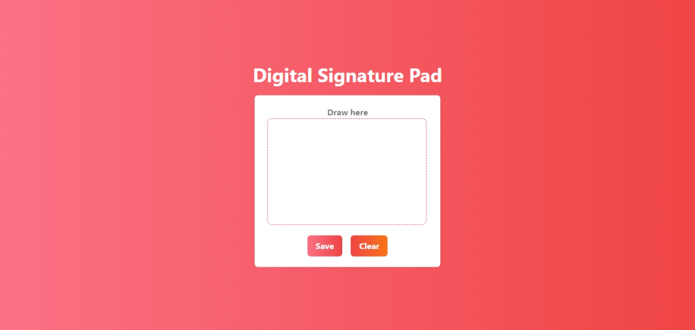
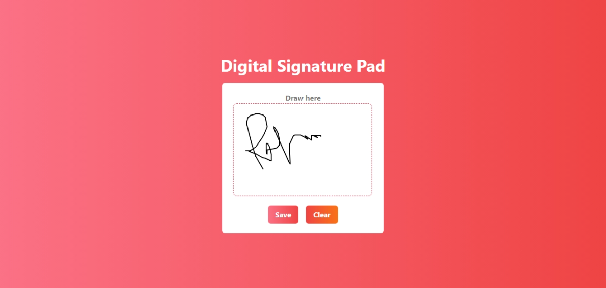

# Digital Signature Pad using React and Tailwind CSS

A simple digital signature pad using React and Tailwind CSS. You can draw your signature on the canvas and download the signature as an image.


## Usage
1. Clone this repository
```bash
git clone https://github.com/AbdurRaahimm/digital-signature-pad.git
```

2. Change the directory
```bash
cd digital-signature-pad
```

3. Run The Essential Dependency
```bash
npm install
```
4. Run `npm run dev` to start the development server
```bash
npm run dev
```
5. Run `npm run build` to build the project
```bash
npm run build
```

## Features
- Draw Signature
- Download Signature as Image
- Clear Signature
- Save LocalStorage Signature 

## Technologies Used
- React
- Tailwind CSS
- HTML Canvas
- LocalStorage

## Demo
[Digital Signature Pad](https://digital-signature-pad.vercel.app/)

## Screenshots




## License
This project is open source and available under the [MIT License](LICENSE).


## Connect on Social Media
- [Twitter](https://twitter.com/AbdurRahim4G)
- [Instagram](https://www.instagram.com/abdurrahim4g/)
- [Facebook](https://www.facebook.com/Rahim72446)
- [LinkedIn](https://www.linkedin.com/in/abdur-rahim4g/)
- [YouTube](https://youtube.com/@AbdurRahimm)


